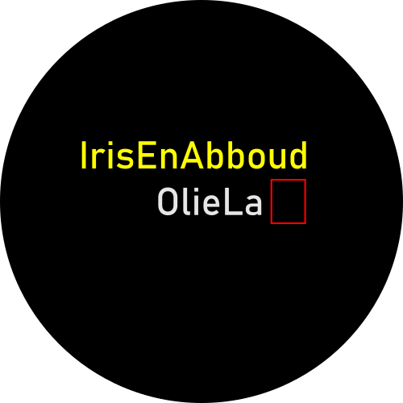

## **Nachtklok Amir®**

Gefeliciteerd met deze **Nachtklok Amir®**. We hopen dat je er jarenlang plezier van hebt. 

In deze **Nachtklok Amir®** kun je twee tijden instellen: eentje wanneer Amir wakker wordt en eentje wanneer hij gaat slapen. Als Amir moet slapen komt er een maan in beeld. Als Amir wakker mag worden verschijnt er een zon in beeld. Dit is een heel handige manier waarop Amir zelf weet wanneer hij zijn bek dicht moet houden. En het grote voordeel is: met andere kinderen werkt het ook.


## Hoe werkt **Nachtklok Amir®**?

De **Nachtklok Amir®** heeft geen interne batterij of klok. Om te weten hoe laat het is moet **Nachtklok Amir®** verbinding maken met een timeserver op internet. **Nachtklok Amir®** doet dat via WiFi. Dit kan een vast WiFi station in huis zijn, maar ook een hotspot. Handig voor als je onderweg bent!

<p align="center">
     
</p>

**Nachtklok Amir®** heeft een scherm en een knop waar je aan kan draaien, en die je kan indrukken. 

In veel menu's kun je een optie selecteren uit een lijst. De lijst kan heel lang zijn. Een deel van de opties valt dan buiten het scherm.

<p align="center">
     
</p>

De optie die in het midden van het scherm staat is de geselecteerde optie (in dit geval ```3```). Deze is in een lichte kleur weergegeven. Je kunt de lijst op en neer bewegen door aan de draaiknop te draaien. Als de lijst op en neer beweegt wordt er een andere optie geselecteerd. Door de knop in te drukken kies je de geselecteerde optie. Het is eigenlijk zo simpel!

Als je aan het eind van de lijst doordraait gaat hij gewoon verder bij het begin. 


## **Nachtklok Amir®** ontgrendelen

Als je vanuit het hoofdscherm op de knop drukt kom je in het ontgrendelscherm.

Om te voorkomen dat Amir zelf aan de instellingen gaat lopen kloten is de nachtklok beveiligd met een wachtwoord. Dit wachtwoord is uiterst geheim. Het is IRIS.

<p align="center">
     
</p>

Hier staan vier vakjes waar je de letters ```I```, ```R```, ```I``` en ```S``` moet invullen. 


In het begin is het eerste hokje rood. Je moet dan met de draaiknop de ```I``` selecteren en de knop indrukken. Als je een fout maakt kun je een karakter teruggaan door ```BCKSP``` te selecteren en op de knop te drukken. Als je toch liever niet wilt ontgrendelen kun je ook ```CANCEL``` kiezen. Als je alle letters goed hebt ingevuld kom je in het scherm met alle opties.


## Het scherm met alle opties

In het volgende scherm heb je meer opties dan je je in je stoutste dromen maar had kunnen voorstellen:

* ```Tijd om op te staan```
* ```Tijd om te gaan slapen```
* ```Klok instellen```
* ```Tijdzone instellen```
* ```Wifi```
* ```Informatie```
* ```Fabrieksinstellingen```
* ```Beginscherm```

Draai de knop om de optie die je wilt kiezen te selecteren, en druk dan de knop in.


## WiFi kiezen en wachtwoord invoeren

We beginnen even met de optie ```WiFi``` uit het bovenstaande lijstje, omdat je dat de eerste keer moet doen als **Nachtklok Amir®** nog helemaal nieuw is.

Het goede nieuws is dat je dit voor ieder WiFi access point maar één keer hoeft te doen. **Nachtklok Amir®** onthoudt de naam van WiFi access points en de wachtwoorden om in te loggen. Het slechte nieuws is dat het best veel werk is.

Als je de optie WiFi kiest gaat **Nachtklok Amir®** even zoeken welke zenders in de buurt zijn. Dit duurt eventjes. Daarna worden de 20 sterkste zenders getoond.

<p align="center">
     
</p>

Kies het station waarmee je wilt verbinden en druk de knop in.

Je komt dan in het volgende scherm, waar je het wachtwoord in kunt voeren.

<p align="center">
     
</p>

Hier zijn eigenlijk vier lijstjes die je met de draaiknop op en neer moet bewegen:

1. Een lijstje met hoofdletters (```ABC```)
2. Een lijstje met kleine letters (```abc```)
3. Een lijstje met cijfers (```123```)
4. Een lijstje met speciale karakters (```!@#```)

In ieder lijstje zijn vier opties blauw weergegeven. Met deze knoppen kun je naar een ander lijstje springen.

<p align="center">
     
</p>

Als je bijvoorbeeld een ```#``` wilt invoeren kies je eerst de optie ```!@#```, en dan staat ```#``` in de opties die je kunt kiezen.

Op deze manier kun je karakter voor karakter je WiFi wachtwoord invoeren. Als je dit hebt gedaan kies je ```OK``` en druk je op de knop. **Nachtklok Amir®** maakt dan verbinding met internet om de klok gelijk te zetten. Dit duurt eventjes. Het menu springt weer terug naar het scherm met alle opties.

**Nachtklok Amir®** geeft nog geen foutmelding als het wachtwoord niet klopt. Je kunt het menu ```Informatie``` gebruiken om te controleren of het gelukt is  om verbinding te maken.


## Tijd om op te staan instellen

Hier kun je instellen op welk tijdstip de maan verdwijnt en de zon verschijnt. Deze tijd wordt bewaard in het geheugen van **Nachtklok Amir®** dus de volgende keer dat je **Nachtklok Amir®** aanzet heeft hij dezelfde tijd weer. Het is echt ongeloofelijk!!


## Tijd om te gaan slapen instellen

Hier kun je instellen op welk tijdstip de maan weer verschijnt. 


## Klok instellen

Deze optie kun je gebruiken als je geen WiFi of internet toegang hebt. Je kunt hiermee de klok gelijk zetten.

Omdat het geld op was heeft de **Nachtklok Amir®** geen batterij. Je moet de klok dus iedere keer opnieuw gelijk zetten  als je hem aan zet.


## Tijdzone instellen

Als je op vakantie bent in een andere tijdzone (of als je gaat emigereren) moet je aan twee dingen denken:
1. Vergeet niet om de **Nachtklok Amir®** mee te nemen
2. Pas de tijdzone aan

Ik heb 24 tijdzones in het lijstje opgenomen. **Nachtklok Amir®** houdt ook rekening met zomer- en wintertijd, maar het kan voorkomen dat in verschillende plaatsen in een tijdzone andere regels gelden voor zomer- en wintertijd. Je moet dan maar even de tijd om op te staan tijdelijk aanpassen. Ik heb bijvoorbeeld ook geen tijdzones met halve uurtjes of kwartiertjes opgenomen. Het leek me geen goed idee om een lijst met 462 tijdzones op te nemen, want dan loop je je helemaal suf te draaien. Dan wordt Amir maar eens een uurtje eerder wakker.

In het scherm ```Informatie``` kun je overigens controleren of de klok de juiste tijd aangeeft.


## Informatie
In dit scherm staat of de WiFi verbonden is, of de klok al gesynchroniseerd is, met welk WiFi station **Nachtklok Amir®** verbonden is, en de huidige tijd.

Je kunt hier controleren of: 
* De klok de juiste tijd heeft
* De juiste tijdzone is gekozen

Als je bij de WiFi een verkeerd wachtwoord hebt ingevuld krijg je nog geen foutmelding. Dat moet ik nog verbeteren. Je merkt natuulijk wel vanzelf dat het niet automatisch lukt om de klok te synchroniseren met de timeserver.


## Fabrieksinstellingen
Met deze optie kun je alle instellingen wissen. Hierdoor vergeet hij ook de namen van alle WiFi stations en de wachtwoorden. Handig voor als je een inval van de politie hebt en je wilt niet dat ze weten waar je allemaal bent geweest! De **Nachtklok Amir®** heeft overal aan gedacht.


## Beginscherm
Hiermee ga je weer terug naar het scherm met het zonnetje of het maantje.


## Wist-u-datjes

### Helderheid scherm
Als je in het hoofdscherm bent (dus met het zonnetje of het maantje) kun je de helderheid van het scherm veranderen door aan de draaiknop te draaien. Dan kan Amir het zelf ook als hij het lampje te fel vind.

Ik heb ervoor gekozen dat je de helderheid van het scherm heel laag kunt zetten zodat je er 's nachts niet wakker van wordt. Het kan dus zijn dat je bij normaal daglicht niks ziet op het scherm omdat de helderheid te laag staat. Je moet dan het wieltje "omhoog" draaien. 

Deze instelling wordt niet bewaard. Iedere keer dat **Nachtklok Amir®** opstart begint hij met de felste instelling van het scherm. Als je in de woestijn bent loop je dus niet het risico dat je niks op het scherm ziet.


### Timeserver, WiFi en internet

De **Nachtklok Amir®** maakt via de WiFi verbinding met een timeserver. Als je **Nachtklok Amir®** met je telefoon verbindt, maar je telefoon is niet verbonden met internet, dan weet **Nachtklok Amir®** nog steeds niet hoe laat het is omdat hij geen verbinding met de timeserver kan maken. Je kunt dan wel de tijd handmatig instellen in het menu ```Klok instellen```.

Als de **Nachtklok Amir®** contact zoekt met de tijdserver kan hij een beetje warm worden. Dit kan geen kwaad. Als de tijd gesynchroniseerd is schakelt hij automatisch de WiFi uit, zodat hij minder stroom verbruikt. De **Nachtklok Amir®** wordt gevoed met 5V uit de USB poort en dat is helemaal veilig.

Zolang de klok niet is gelijk gezet blijft **Nachtklok Amir®** proberen om contact te zoeken met de server. Zodra je de tijd handmatig instelt stopt hij daarmee, en dan wordt hij dus ook minder warm.

Als je te hard aan het snoertje trekt gaat **Nachtklok Amir®** stuk. Het is misschien niet zo'n goed idee om hem in bed te leggen. Ik zou eventueel wel een beugeltje kunnen printen dat je ergens tegenaan kan plakken of schroeven. 

### Nachtdienst?
Normaal gesproken zou je verwachten dat Amir 's morgens opstaat en 's avonds weer gaat slapen. Bijvoorbeeld opstaan om 7:00 en gaan slapen om 20:00. Het zonnetje verschijnt dan tussen 7:00 en 20:00.

Maar stel dat iemand instelt dat Amir om 7:00 gaat slapen en om 20:00 weer opstaat, dan verschijnt het maantje overdag en het zonnetje 's nachts. Dat klopt in principe natuurlijk wel maar eigenlijk zou de **Nachtklok Amir®** dan een mailtje naar de kinderbescherming® moeten sturen.

### Time out
Als je een paar minuten niet op de knop drukt of eraan draait springt **Nachtklok Amir®** terug naar het zonnetje of het maantje.


## To do
Wat ik nog wil verbeteren:
* Je kunt nu bij de tijden ook 26:00 of iets dergelijks instellen. Dat is natuurlijk superdom van degene die het doet maar eigenlijk had ik dat moeten voorkomen.
* Melding geven of het wachtwoord van de WiFi klopt.
* Eigenlijk wil ik icoontjes maken voor ```OK```, ```Cancel``` en ```BCKSP```.


## Bugs 

Als je nog een foutje vind, stuur dan een mailtje naar __noreply@microsoft.com__. Zij reageren meestal of soms binnen een bepaalde tijd.
